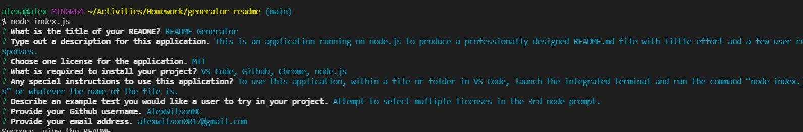
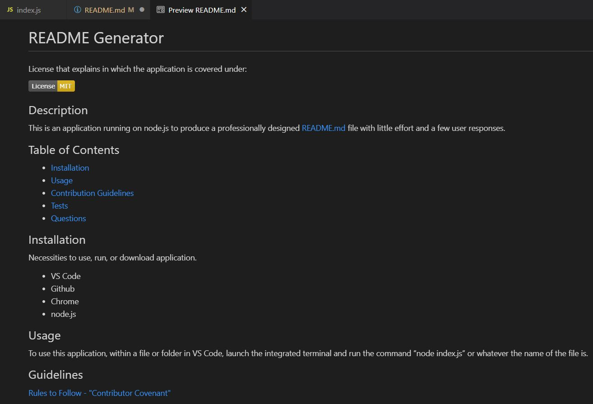

# README Generator

## Description
- This is the README of the submission and repo.

- In my Github repository, youll find "SAMPLE.md," which is the rendered readme using the app that's screenchoted below if needed.

- Below is a link to the video of the application running in real time.

- Also below, screenshots of the generated README from the node.js input from mentioned video(screen recording).

## Video
[Video of Working App](https://drive.google.com/file/d/1qjD76eY1S6NztR-WmvTiRoaiXRs425g1/view)

## Screenshots
- Screenshot of terminal after entering answers.

- Screenshot of rendered Readme
- (screenshot is partially cutoff at bottom, refer to video or SAMPLE.md in github)
